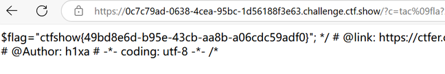

问题：

做命令执行的时候发现一个奇怪的地方，

这个题目绕空格用<和<>的话，flag就不能用fla？

而如果用%09的话，flag就可以用fla?

也就是说，<不能和通配符“？”或“*”一起用，但是在我自己的虚拟机里，他们又可以一起用，感觉好怪啊，有没有大佬来解释下为啥啊

`CharlesZ`师傅解答:

最后补充我（the0n3）的测试过程：

https://the0n3.top/pages/47314c/

对于简单的shell环境如linux发行版alpine的默认/bin/ash，在使用`<`、`>`重定向符和问号`?`一起使用时，shell环境会真的去查找`fla?`这个文件，而不是将`?`当作通配符。

对于一些复杂的shell环境如/bin/bash，`<`、`>`重定向符和问号`?`一起使用时，shell环境会将`?`当作通配符进行匹配。

